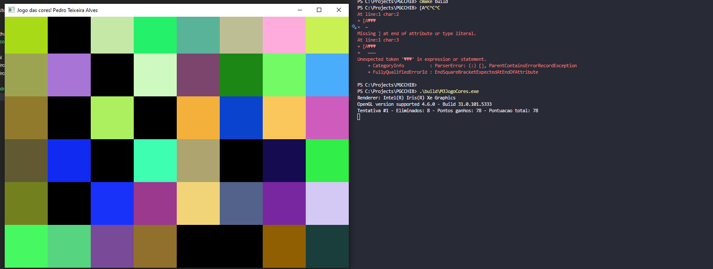
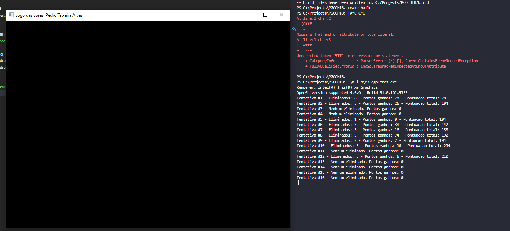
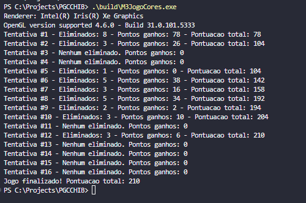
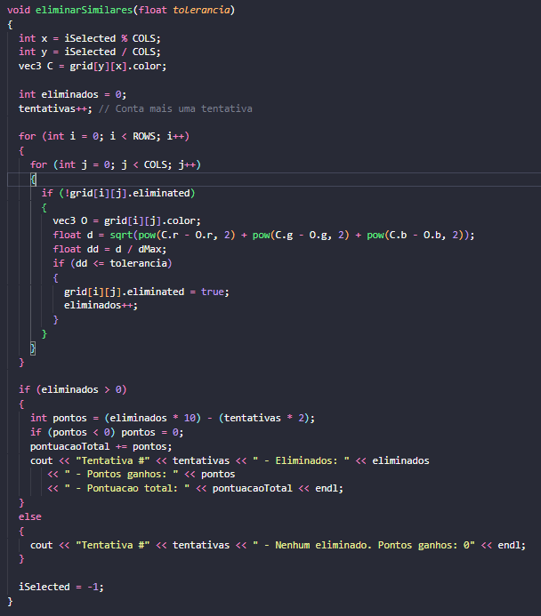
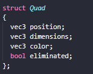
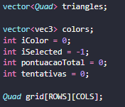

# 🎨 Jogo das Cores

Este é um jogo simples feito em C++ com OpenGL, GLFW e GLAD. O objetivo é selecionar uma cor e eliminar os retângulos que possuem cores semelhantes.

## 🕹️ Como jogar

1. Clique em um dos retângulos coloridos.
2. O jogo irá eliminar os retângulos com cores parecidas com a cor clicada.
3. A pontuação é baseada na quantidade de retângulos eliminados.

## Imagens

### Primeira rodada

### Meio do jogo

### Resultado final

## Trechos do código

### Lógica para remover similares e pontuação

### Inicialização da matriz

### Struct

### Definição de variáveis
