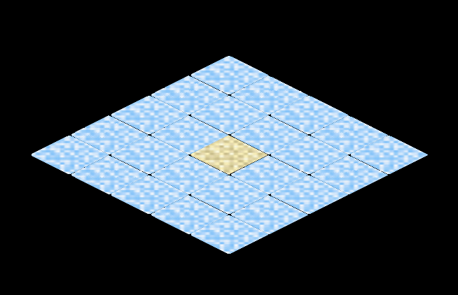

# Exercício de Tilemap Isométrico

Alunos: Diuliano Vargas, Felipe Bergamo, Pedro Teixeira Alves

## Descrição

Projeto de Computação Gráfica com foco em **tilemaps isométricos**, utilizando o tipo **Diamond**.

O objetivo é desenhar um mapa simples e permitir a navegação entre os tiles usando o teclado.

---

## Tileset utilizado


## Configuração mapa utilizado

```cpp
int map[5][5] = {
4, 4, 4, 4, 4,
4, 4, 4, 4, 4,
4, 4, 4, 4, 4,
4, 4, 4, 4, 4,
4, 4, 4, 4, 4,
};
```
## Imagem do mapa



### Navegação
```text
W → Norte
S → Sul
A → Oeste
D → Leste
Q → Noroeste (NW)
E → Nordeste (NE)
Z → Sudoeste (SW)
X → Sudeste (SE)
```


